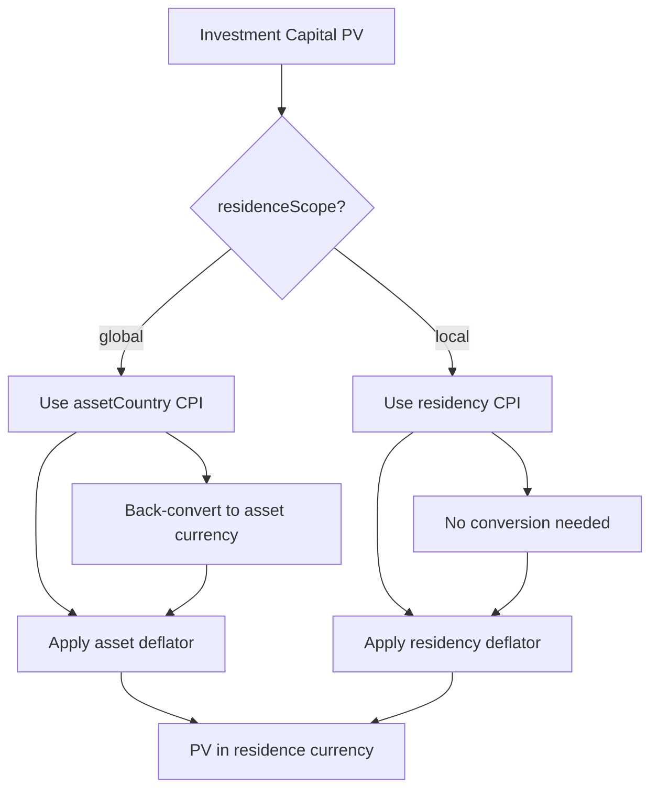
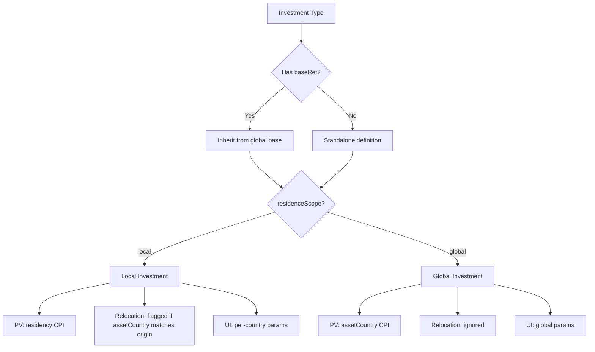
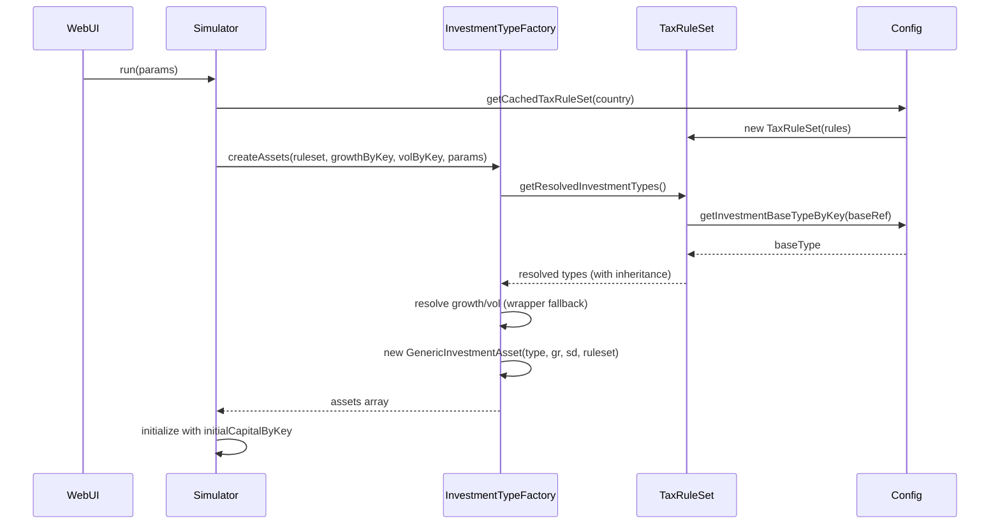

## Tax Rules JSON Reference

This document explains the structure and meaning of the `tax-rules-<country>.json` files under `src/core/config/`.  
Each file describes one country’s tax system, locale settings, and investment definitions. Fields are designed to be:

- **Country-specific** but structurally similar across countries,
- **Data only** (no logic) so that `TaxRuleSet` and the simulator can consume them uniformly,
- **Extensible** for future rules without breaking existing scenarios.

The examples below reference the current IE (`tax-rules-ie.json`) and AR (`tax-rules-ar.json`) files.

---

## 1. Top-Level Metadata

- **`country`**: Two-letter country code (upper case), e.g. `"IE"`, `"AR"`.
- **`countryName`**: Human-readable country name, e.g. `"Ireland"`, `"Argentina"`.
- **`version`**: Ruleset version string, e.g. `"26.4"`, `"1.0"`.
- **`updateMessage`**: Short description of what changed in this ruleset version.

---

## 2. Locale and Economic Data

### 2.1 `locale`

Controls how numbers and currencies are formatted for this country:

- **`numberLocale`**: BCP-47 locale string used for number formatting in the UI, e.g. `"en-IE"`, `"es-AR"`.
- **`currencyCode`**: ISO currency code for the country’s primary currency, e.g. `"EUR"`, `"ARS"`.
- **`currencySymbol`**: Display symbol for the primary currency, e.g. `"€"`, `"$"`.

### 2.2 `economicData`

Provides scalar economic parameters used by `EconomicData` as base anchors:

- **`inflation`**:
  - `cpi`: Long-run CPI level or rate (percentage, not decimal), e.g. `1.0499` for IE, `25.7` for AR.
  - `year`: Reference year for the CPI data.
- **`purchasingPowerParity`**:
  - `value`: PPP cross-rate vs EUR (units of local currency per 1 EUR in PPP terms).
  - `year`: Reference year for PPP data.
- **`exchangeRate`**:
  - `perEur`: Nominal FX rate (units of local currency per 1 EUR).
  - `asOf`: Date of the FX observation.

These values are used to construct per-country economic profiles consumed by `EconomicData` and, indirectly, `InflationService` and FX conversion helpers.

---

## 3. Income Tax

### 3.1 `incomeTax`

Defines the core income tax structure:

- **`name`**: Display name or abbreviation, e.g. `"IT"` or `"Impuesto a las Ganancias"`.
- **`tooltip`** (optional): Short explanation for UI tooltips.
- **`personalAllowance`**: Universal tax-free allowance (if any), in local currency.
- **`taxCredits`** (optional):
  - Structured object defining named credits, e.g.:
    - `employee.min.amount` and `employee.min.rate` (credit tied to PAYE income).
    - `age` bands like `"65": 245` (additional credits by age).
- **`ageExemptionAge` / `ageExemptionLimit`** (optional, IE):
  - Age and income threshold for age-based income tax exemption.
- **`jointFilingAllowed`** (optional, IE): Whether couples can file jointly.
- **`jointBandIncreaseMax`** (optional, IE): Max extra standard rate band for the secondary earner.
- **`bracketsByStatus`**:
  - Maps filing status → bracket map:
    - Keys: income thresholds as strings, e.g. `"0"`, `"44000"`.
    - Values: marginal tax rates as decimals, e.g. `0.2`, `0.4`.
  - Example statuses:
    - `"single"`,
    - `"singleWithDependents"`,
    - `"married"`.

The simulator and `Taxman` use these brackets to compute income tax on taxable income, respecting filing status and joint rules when available.

---

## 4. Social Contributions and Additional Taxes

### 4.1 `socialContributions`

Array of social contribution definitions (PRSI, ANSES, health insurance, etc.):

Each entry may include:

- **`name`**: Name of the contribution (e.g. `"PRSI"`, `"ANSES"`, `"Obra Social"`).
- **`tooltip`** (optional): UI description.
- **`rate`**: Contribution rate as a decimal (e.g. `0.042`, `0.11`).
- **`incomeCap`** (optional): Maximum income subject to this contribution (null for no cap).
- **`ageAdjustments`** (optional, IE PRSI):
  - Map from age threshold to adjusted rate, e.g. `{ "70": 0 }` to turn off PRSI after 70.
- **`applicableIncomeTypes`**:
  - Array of income buckets this contribution applies to, e.g. `["employment"]`, `["employment", "self"]`.

### 4.2 `additionalTaxes`

Array of additional tax definitions, such as USC in IE:

- **`name`**: Name, e.g. `"USC"`.
- **`tooltip`** (optional): UI description.
- **`brackets`**: Map threshold → rate (decimal), similar to income tax.
- **`incomeExemptionThreshold`** (optional): Income level below which this tax is not charged.
- **`reducedRateAge` / `reducedRateMaxIncome`** (optional): Age/income triggers for reduced USC schedules.
- **`ageBasedBrackets`** (optional): Alternate brackets by age (e.g. `"70": { ... }`).
- **`base`**: Base measure, currently `"income"` (used to decide what flows this tax applies to).

---

## 5. Capital and Investment Taxes

### 5.1 `capitalGainsTax`

Defines the generic CGT regime for the country:

- **`name`** / **`tooltip`** (optional, IE): Used in UI labels.
- **`rate`**: Capital gains tax rate as a decimal, e.g. `0.33`, `0.15`.
- **`annualExemption`**: Annual CGT exemption (local currency).
- **`allowLossOffset`**: Whether capital losses can offset gains.
- **`deemedDisposalYears`** (optional, IE): Generic deemed disposal interval (years) for exit-tax-like regimes.

This is the default CGT profile; specific investment types may override or reference it.

### 5.2 `dividendTax` (optional, IE)

Defines how dividends are taxed when separated from capital gains:

- **`rate`**: Tax rate on dividends as a decimal.
- **`annualExemption`**: Exemption amount (if any).
- **`withholding`**: Whether withholding tax is assumed to have already been applied.

### 5.3 `interestTax` (optional, IE)

Defines how interest income is taxed:

- **`rate`**: Tax rate on interest.
- **`withholding`**: Whether withholding tax is assumed.

### 5.4 `wealthTax` and `inheritanceTax` (optional)

Placeholders for future wealth/inheritance taxes:

- **`wealthTax`**:
  - `brackets`: Threshold → rate map (currently empty in IE).
  - `exemptions`: List of exemptions (currently empty).
- **`inheritanceTax`**:
  - `threshold`: Tax-free inheritance threshold.
  - `rate`: Inheritance tax rate as a decimal.

These fields are reserved for possible future features.

---

## 6. Pension Rules

### 6.1 `pensionRules`

Configures both state and private pension behaviour:

- **Retirement ages**:
  - `minRetirementAgePrivate`: Min age for private pension drawdown.
  - `minRetirementAgeOccupational`: Min age for occupational schemes.
  - `minRetirementAgeState`: Min age for state pension eligibility.
  - `statePensionAge`: The age at which state pension begins (duplicated for convenience).
- **Contribution limits**:
  - `contributionLimits.ageBandsPercent`:
    - Map from age to maximum contribution fraction (decimal), e.g. `{ "0": 0.15, "30": 0.2, ... }`.
  - `contributionLimits.annualCap`:
    - Maximum pensionable earnings for contribution calculations.
- **Lump sum rules**:
  - `lumpSumTaxBands`: Threshold → tax rate map for lump sums.
  - `lumpSumMaxPercent`: Max share of pension that can be taken as lump sum (decimal).
- **Drawdown rules**:
  - `minDrawdownRates`: Map age → minimum drawdown fraction for ARF/AMRF-like regimes.
- **State pension specifics**:
  - `statePensionIncreaseBands`:
    - Map from age to weekly increase amount (e.g. extra after age 80).
- **System type**:
  - `pensionSystem.type`:
    - `"state_only"`: Only state pension exists (no private pillar).
    - `"mixed"`: Both state and private pillars exist.
- **Defined benefit treatment** (optional, IE):
  - `definedBenefit.treatment`:
    - How DB income is treated for tax (e.g. `"privatePension"`, `"salary"`).

The simulator uses these rules to:

- Cap pension contributions from salaries,
- Determine drawdown and lump sums,
- Drive state pension age and escalators,
- Decide how DBI events are classified for tax.

---

## 7. Residency Rules

### 7.1 `residencyRules`

Configures cross-border tax behaviour:

- **`postEmigrationTaxYears`**:
  - Number of years after emigration during which the country may still tax certain income (e.g. 3 years for IE).
- **`taxesForeignIncome`**:
  - Boolean indicating whether, during those trailing years, foreign income is still within scope.

`Taxman` uses these rules alongside relocation events to determine which countries have active taxing rights in a given simulation year.

---

## 8. Investment Types

> **Note**: For details on how investment types interact with the relocation system (currency, residence scope), see [`docs/relocation-system.md`](../relocation-system.md).

### 8.1 `investmentTypes`

Defines generic investment categories (index funds, shares, etc.) and their tax treatment. Each item in this array represents a distinct asset class available to the user.

These definitions control how `Equities` instances (index funds, shares) are taxed when sold or deemed disposed of. The Irish rules, for example, treat:

- `indexFunds` under an exit-tax regime with deemed disposals,
- `shares` under standard CGT referencing `capitalGainsTax`.

### 8.2 Investment Type Fields

Each entry in the `investmentTypes` array supports the following fields:

- **`key`**: Stable identifier used in the core engine (e.g., `"indexFunds_ie"`, `"shares_ar"`).
- **`label`**: Human-readable name displayed in the UI.
- **`baseRef`** (optional): Reference to a global base type key (e.g., `"globalEquity"`).
  - Triggers a shallow merge: `{...baseType, ...localType}`.
  - Resolved by `TaxRuleSet.getResolvedInvestmentTypes()`.
  - Enables wrappers to inherit economic defaults while overriding taxation.
- **`baseCurrency`**: ISO currency code for the asset (e.g., `"EUR"`, `"USD"`, `"ARS"`).
  - Inherited from `baseRef` if omitted.
  - Used for FX conversion in multi-currency scenarios.
- **`assetCountry`**: Two-letter country code for the asset's economic home (e.g., `"ie"`, `"us"`, `"ar"`).
  - Inherited from `baseRef` if omitted.
  - Determines which country's CPI is used for PV deflation (when scope is global).
- **`residenceScope`**: `"local"` or `"global"`.
  - **`"local"`**: Asset tied to residency; PV uses residency CPI; flagged by relocation detector.
  - **`"global"`**: Portable asset; PV uses `assetCountry` CPI; ignored by relocation detector.
  - See section 8.4 for detailed semantics.
- **`taxation`**: Object describing how this type is taxed:
  - **Exit tax-style regimes**:
    - `exitTax.rate`: Exit tax rate as a decimal.
    - `exitTax.deemedDisposalYears`: Deemed disposal interval (years).
    - `exitTax.allowLossOffset`: Whether losses can offset gains.
    - `exitTax.eligibleForAnnualExemption`: Whether CGT annual exemption applies.
  - **Capital gains regimes**:
    - `capitalGains.rate` or `capitalGains.rateRef`:
      - Fixed rate, or reference into `capitalGainsTax.rate`.
    - `capitalGains.annualExemption` or `annualExemptionRef` (optional):
      - Either a literal exemption or reference into `capitalGainsTax.annualExemption`.
    - `capitalGains.allowLossOffset`:
      - Whether losses can offset gains.

#### Examples

**Example 1: IE Index Funds (Local wrapper of global asset)**
```json
{
  "key": "indexFunds_ie",
  "label": "Index Funds",
  "baseRef": "globalEquity",
  "baseCurrency": "EUR",
  "assetCountry": "ie",
  "residenceScope": "local",
  "taxation": {
    "exitTax": {
      "rate": 0.38,
      "deemedDisposalYears": 8,
      "allowLossOffset": false,
      "eligibleForAnnualExemption": false
    }
  }
}
```
- Inherits `baseKey: "globalEquity"` from global rules
- Overrides `baseCurrency` to EUR (IE domiciled)
- Overrides `assetCountry` to `ie` (local)
- Sets `residenceScope: "local"` (tied to IE residency)
- Defines IE-specific exit tax treatment

**Example 2: AR CEDEARs (Global wrapper)**
```json
{
  "key": "shares_ar",
  "label": "CEDEARs",
  "baseRef": "globalEquity",
  "baseCurrency": "USD",
  "assetCountry": "us",
  "residenceScope": "global",
  "taxation": {
    "capitalGains": {
      "rateRef": "capitalGainsTax.rate",
      "allowLossOffset": true
    }
  }
}
```
- Inherits from `globalEquity` but keeps USD/US domicile
- Sets `residenceScope: "global"` (portable)
- Uses AR's CGT rate via `rateRef`

**Example 3: AR MERVAL (Pure local asset)**
```json
{
  "key": "indexFunds_ar",
  "label": "MERVAL",
  "baseCurrency": "ARS",
  "assetCountry": "ar",
  "residenceScope": "local",
  "taxation": {
    "capitalGains": {
      "rateRef": "capitalGainsTax.rate",
      "allowLossOffset": true
    }
  }
}
```
- No `baseRef` (standalone)
- ARS currency, AR domicile
- Local scope (tied to AR residency)

### 8.3 Economic Data Flows

Document how growth/volatility parameters flow through the system:

**Global Asset Parameters** (visible in economy panel):
- **Format**: `GlobalAssetGrowth_{baseKey}`, `GlobalAssetVolatility_{baseKey}`
- **Example**: `GlobalAssetGrowth_globalEquity`, `GlobalAssetVolatility_globalBonds`
- **Source**: `src/core/config/tax-rules-global.json` defines base types
- **UI**: Rendered as visible rows in growth rates table (`src/frontend/web/WebUI.js`)
- **Usage**: Read by `InvestmentTypeFactory.resolveMixConfig()` for mix assets

**Local Asset Parameters** (per-country):
- **Format**: `LocalAssetGrowth_{cc}_{baseKey}`, `LocalAssetVolatility_{cc}_{baseKey}`
- **Example**: `LocalAssetGrowth_ie_indexFunds`, `LocalAssetVolatility_ar_merval`
- **UI**: Rendered in per-country tabs when relocation is enabled
- **Usage**: For local investments without `baseRef`

**Wrapper-Level Parameters** (legacy, hidden):
- **Format**: `{key}GrowthRate`, `{key}GrowthStdDev`
- **Example**: `indexFunds_ieGrowthRate`, `shares_arGrowthStdDev`
- **UI**: Created but hidden (`src/frontend/web/WebUI.js`)
- **Usage**: Backward compatibility fallback in `InvestmentTypeFactory.createAssets()`
- **Serialization**: Preserved in CSV for legacy scenario compatibility
- **Status**: Deprecated; use asset-level params for new scenarios

**Parameter Resolution Order** (in `InvestmentTypeFactory.createAssets()`):
1. Try `growthRatesByKey[key]` (e.g., `indexFunds_ie`)
2. If undefined and key has country suffix, try base key (e.g., `indexFunds`) — **backward compat**
3. Default to 0 if still undefined

### 8.4 `residenceScope` Semantics

> **Note**: For implementation details of PV deflation, see `src/core/PresentValueCalculator.js`.

Describes the behavioral differences between local and global scope:

| Aspect | `residenceScope: "local"` | `residenceScope: "global"` |
|--------|---------------------------|----------------------------|
| **PV Deflation** | Uses **residency CPI** (where you live) | Uses **assetCountry CPI** (asset's home) |
| **Relocation Impact** | Flagged if `assetCountry === originCountry` and capital > 0 | Not flagged (portable) |
| **UI Parameters** | Per-country rows: `LocalAssetGrowth_{cc}_{baseKey}` | Global rows: `GlobalAssetGrowth_{baseKey}` |
| **Serialization** | Saves wrapper-level growth/vol for locals | No per-country params saved |
| **Use Case** | Country-specific investments (e.g., IE domiciled funds, AR MERVAL) | Portable global assets (e.g., US ETFs, CEDEARs) |

**PV Deflation Logic**:


**Relocation Impact Detection** (`src/frontend/web/components/RelocationImpactDetector.js`):
- Local holdings with `assetCountry === originCountry` trigger "local_holdings" impact
- User prompted to keep/sell/reinvest when relocating
- Global holdings ignored (assumed portable)

**`residenceScope` Decision Tree**:


### 8.5 Runtime: GenericInvestmentAsset and InvestmentTypeFactory

> **Note**: See `src/core/InvestmentTypeFactory.js` for implementation details.

**`GenericInvestmentAsset`**:
- Extends `Equity` base class.
- Configured by `investmentTypeDef` from tax rules.
- Resolves tax category (exit tax vs CGT), deemed disposal, loss offset, annual exemption.
- Captures `baseCurrency`, `assetCountry`, `residenceScope` for multi-currency support.
- Overrides `buy()` to capture currency/country from first call if undefined.

**`InvestmentTypeFactory.createAssets()`**:
- Loads `investmentTypes` from `TaxRuleSet.getResolvedInvestmentTypes()` (with `baseRef` inheritance).
- Resolves growth/volatility from `growthRatesByKey`/`stdDevsByKey` maps.
- Applies backward compat fallback for base keys.
- Resolves mix configuration from params (if enabled).
- Returns array of `{ key, label, asset, baseCurrency, assetCountry, residenceScope }`.

**Simulator Integration** (`src/core/Simulator.js`):
- Calls `InvestmentTypeFactory.createAssets()` for each scenario country.
- Deduplicates by key across countries.
- Initializes assets with `initialCapitalByKey` (filtered to StartCountry types).
- Maintains legacy `indexFunds`/`shares` objects for backward compat.

**Investment Type Resolution Flow**:


### 8.6 Audit Findings: Wrapper-Level Economic Data

**Current Usage**:
1. **Backward Compat Fallback**: `InvestmentTypeFactory.createAssets()` reads wrapper-level params if namespaced key not found.
2. **CSV Serialization**: `Utils.serializeSimulation()` writes wrapper-level params; `deserializeSimulation()` reads them.
3. **UI Hidden Inputs**: `WebUI.renderInvestmentParameterFields()` creates hidden inputs for serialization.
4. **Test Framework**: `TestFramework.js` maps legacy test params to wrapper-level keys.

**Migration Path**:
- **Option 1 (Conservative)**: Keep wrapper-level params for backward compat; document as deprecated.
- **Option 2 (Clean)**: Remove wrapper-level params; migrate legacy CSV files during deserialization.
  - Add migration logic in `Utils.deserializeSimulation()` to detect wrapper-level params and convert to asset-level.
  - Update tests to use asset-level params.
  - Remove hidden inputs from `WebUI.renderInvestmentParameterFields()`.
  - Remove fallback from `InvestmentTypeFactory.createAssets()`.

**Current Status**: Wrapper-level params are preserved for backward compatibility. Removal is deferred to a future cleanup phase.

### 8.7 Global Base Types

**Purpose**: Define reusable asset templates for multi-country scenarios.

**Location**: `src/core/config/tax-rules-global.json`.

**Schema**:
```json
{
  "investmentBaseTypes": [
    {
      "baseKey": "globalEquity",
      "label": "Global Equity",
      "shortLabel": "Eq",
      "baseCurrency": "USD",
      "assetCountry": "us",
      "residenceScope": "global"
    }
  ]
}
```

**Fields**:
- **`baseKey`**: Unique identifier referenced by `baseRef` in country rules.
- **`label`**: Full name for UI display.
- **`shortLabel`**: Abbreviated label for compact UI (e.g., mix dropdowns).
- **`baseCurrency`**, **`assetCountry`**, **`residenceScope`**: Default values inherited by wrappers.

**Usage**:
- Accessed via `Config.getInvestmentBaseTypes()`.
- Merged into country-specific types by `TaxRuleSet.getResolvedInvestmentTypes()`.
- Used in mix configuration dropdowns (`src/frontend/web/WebUI.js`).

**Current Base Types**:
1. **`globalEquity`**: USD-denominated, US-domiciled, global scope.
2. **`globalBonds`**: USD-denominated, US-domiciled, global scope.

---

## 9. Pinned Income Types

### 9.1 `pinnedIncomeTypes`

Specifies which income series should always be visible and emphasised in the UI:

- Array of income metric keys, e.g.:
  - `["incomeSalaries", "incomeStatePension", "incomeCash"]`.

The frontend uses this list to:

- Ensure important income types are always present in the table/legend,
- Maintain a consistent visual ordering for key flows.

---

## 10. Extensibility

The tax rules schema is intentionally extensible:

- New fields can be added under existing sections without breaking older scenarios, provided defaults are sensible.
- Future features (e.g. wealth tax, more detailed social contributions, investment currency semantics) should:
  - Declare their fields in a dedicated doc section,
  - Keep behaviour data-driven via `TaxRuleSet`,
  - Avoid mixing logic into the JSON.

The current files (`tax-rules-ie.json`, `tax-rules-ar.json`) should be considered the authoritative examples for field usage until further countries are added.

