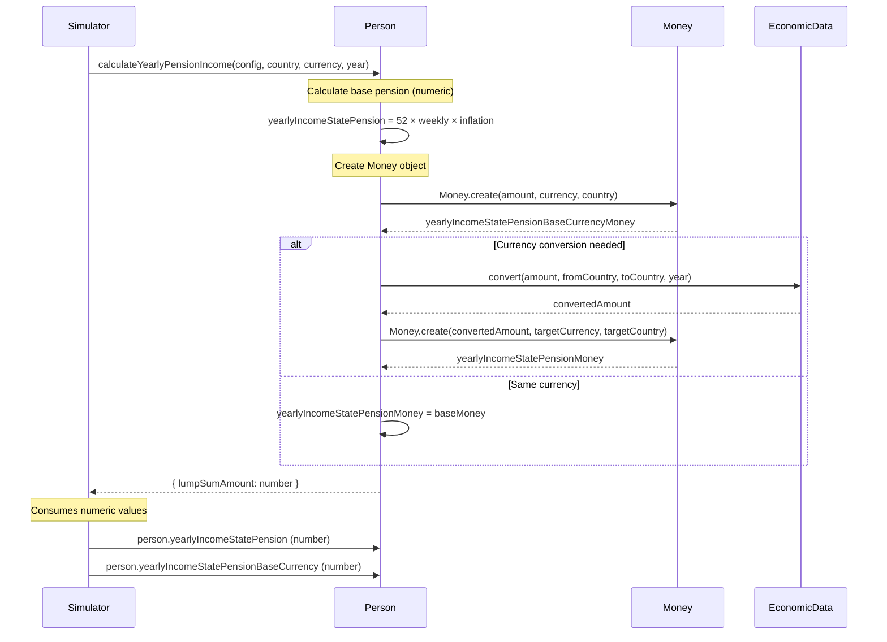

# Money Architecture

## State Pension Currency Tracking

### Money Object Implementation

State pension income uses Money objects for currency safety:
- **Numeric Path**: `yearlyIncomeStatePension` (number, converted to residence currency)
- **Money Path**: `yearlyIncomeStatePensionMoney` (Money object with explicit currency/country)

### Calculation Flow

1. Compute base pension amount (52 weeks × weekly rate, inflated)
2. Create `Money` object with `statePensionCurrency` and `statePensionCountry`
3. Convert to residence currency if needed (both numeric and Money paths)
4. Return numeric values to Simulator (Money objects remain internal)

## Verification Checklist

- [ ] All existing tests pass without modification (`./run-tests.sh`)
- [ ] `TestMoneyPersonIntegration.js` test passes
- [ ] Performance overhead <1% for state pension calculation
- [ ] Multi-currency relocation scenarios work correctly
- [ ] No changes to Simulator or other consuming code needed

## Performance Validation

Baseline results are tracked in `docs/money-performance-baseline.md`.

## Architecture Diagram

## Risk Mitigation

| Risk | Mitigation |
|------|------------|
| Performance degradation | Benchmark shows <1% overhead; Money creation only when pension > 0 |
| Breaking existing tests | No API changes; all methods return numbers; tests pass without modification |
| Currency resolution failures | Fallback to null Money objects; legacy numeric path continues working |
| Conversion errors | Currency validation at boundaries; errors logged and handled gracefully |
