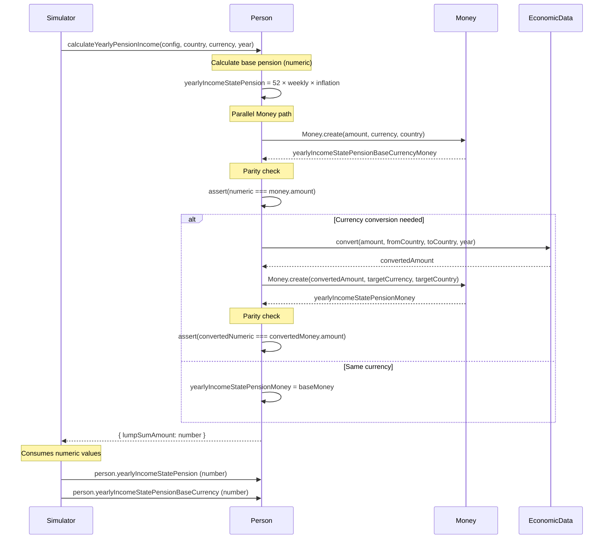

# Money Architecture

## State Pension Currency Tracking

### Dual-Track Implementation

State pension income uses parallel tracking:
- **Legacy Path**: `yearlyIncomeStatePension` (number, converted to residence currency)
- **Money Path**: `yearlyIncomeStatePensionMoney` (Money object with explicit currency/country)

### Calculation Flow

1. Compute base pension amount (52 weeks × weekly rate, inflated)
2. Create `Money` object with `statePensionCurrency` and `statePensionCountry`
3. Convert to residence currency if needed (both numeric and Money paths)
4. Assert parity between numeric and Money amounts (tolerance: 0.01)
5. Return numeric values to Simulator (no API changes)

### Parity Verification

Use `person.verifyStatePensionParity()` to check dual-track consistency:
- Returns `{success: boolean, errors: string[], details: object}`
- Called automatically during calculation (throws on mismatch)
- Available for explicit testing/debugging

## Verification Checklist

- [ ] All existing tests pass without modification (`./run-tests.sh`)
- [ ] New `TestMoneyPersonIntegration.js` test passes
- [ ] Parity assertions trigger correctly on intentional mismatches
- [ ] Performance overhead <1% for state pension calculation
- [ ] Multi-currency relocation scenarios work correctly
- [ ] `verifyStatePensionParity()` returns correct results
- [ ] No changes to Simulator or other consuming code needed
- [ ] Documentation updated with dual-track pattern

## Performance Validation

Baseline results are tracked in `docs/money-performance-baseline.md`.

## Architecture Diagram

## Risk Mitigation

| Risk | Mitigation |
|------|------------|
| Parity checks fail in edge cases | Comprehensive test coverage including zero amounts, null currencies, conversion failures |
| Performance degradation | Benchmark shows <1% overhead; Money creation only when pension > 0 |
| Breaking existing tests | No API changes; all methods return numbers; tests pass without modification |
| Currency resolution failures | Fallback to null Money objects; legacy numeric path continues working |
| Conversion errors | Match legacy behavior (set to 0); parity checks detect mismatches |
