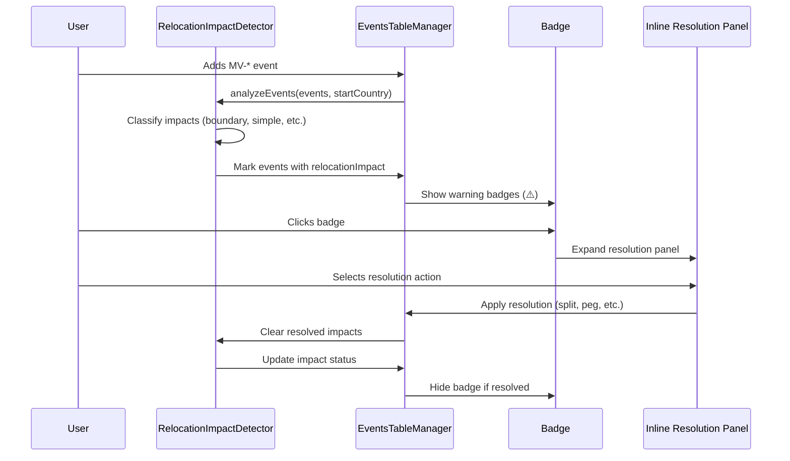
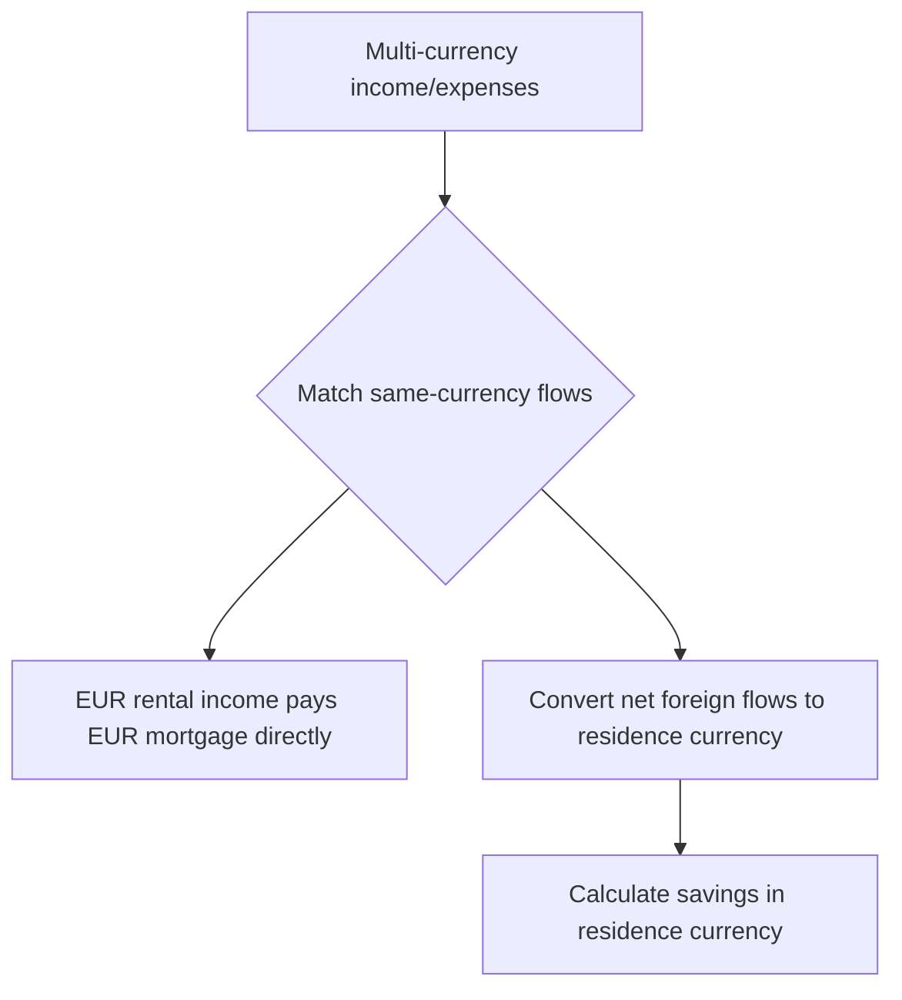

# Relocation System Documentation

## Overview

The Relocation System enables users to simulate moving between countries with different tax systems, currencies, and economic conditions. This premium feature provides a realistic modeling of international relocations, including currency conversions, cross-border taxation, and pension system conflicts.

### Core Philosophy

**Natural Currency Flows:** Financial events maintain their natural currencies based on location or specification. Foreign income and expenses in the same currency offset directly, with only net foreign flows converting to residence currency.

**Runtime Residency Derivation:** Country context is derived dynamically from relocation events during simulation, eliminating the need for separate residency timelines.

**Zero-Hints Premium Gating:** When disabled, the feature is completely invisible—no placeholders, disabled buttons, or tooltips hint at its existence.

### Key Capabilities

- **Currency Conversion:** Real-time conversion using PPP-adjusted exchange rates with multiple modes (constant, PPP, reversion).
- **Cross-Border Taxation:** Support for trailing taxation rules (e.g., Ireland's 3-year post-emigration tax).
- **Impact Detection:** Automatic analysis of events affected by relocations, with user-guided resolution.
- **Resolution Assistance:** Inline panels provide contextual tools for splitting events, pegging currencies, and linking countries.

## Architecture

### Core Components

#### 1. EconomicData.js (`src/core/EconomicData.js`)
- **Purpose**: Synchronous accessor for CPI, FX, and PPP data embedded in tax rule files.
- **Responsibilities**:
  - Currency conversion with multiple modes (constant, PPP-adjusted, reversion).
  - Inflation adjustments over time using embedded economic profiles.
  - Fallback handling when data is missing.

#### 2. RelocationImpactDetector.js (`src/frontend/web/components/RelocationImpactDetector.js`)
- **Purpose**: Analyzes event timelines when relocation events are added or modified.
- **Responsibilities**:
  - Classifies affected events into categories (boundary crossers, simple events, property auto-peg, pension conflicts).
  - Modifies events in-place by adding `relocationImpact` metadata.
  - Clears resolved impacts automatically.

#### 3. Inline Resolution Panels
- **Purpose**: Contextual resolution tools integrated into EventsTableManager and EventAccordionManager.
- **Responsibilities**:
  - Expand below event rows to show economic context and smart suggestions.
  - Provide one-click actions for resolution (split, peg, link, convert).

#### 4. Currency Selectors
- **Purpose**: Inline dropdowns for specifying event currencies.
- **Responsibilities**:
  - Appear in amount inputs with symbol prefix (€, $) and caret (▼).
  - Integrated into chart controls and table mode toggles.

### Data Flow



## Event Model Extensions

### SimEvent Fields

The `SimEvent` class includes three optional fields for multi-country support:

- **`currency`**: Pegs the event amount to a specific currency (e.g., "EUR" for a mortgage that remains in euros after relocation).
- **`linkedCountry`**: Ties the event to a country for location-specific inflation (e.g., Irish property rental continues at Irish CPI rates).
- **`linkedEventId`**: Links split events that originated from a single boundary-crossing event.

```javascript
// Example SimEvent with multi-country fields
{
  type: "R",
  name: "Dublin Apartment",
  amount: "300000",
  fromAge: "30",
  toAge: "65",
  currency: "EUR",        // Pegged to EUR
  linkedCountry: "ie",    // Irish inflation
  linkedEventId: null     // Not a split event
}
```

### Relocation Event Structure

Relocation events use type codes like `MV-IE` (move to Ireland) or `MV-AR` (move to Argentina):

- **`name`**: Destination country display name (e.g., "→ Argentina").
- **`amount`**: One-off relocation cost in destination currency.
- **`fromAge`**: Point-in-time event specifying when the move occurs.
- **`rate`**: Optional per-country inflation override for the destination.

## Impact Detection System

### Event Classification

When relocation events are added, the detector classifies affected events into five categories:

- **Boundary Crossers**: Events spanning relocation boundaries (e.g., salary from age 30-40 when relocating at 35) need splitting or currency pegging.
- **Simple Events**: Events entirely within the new country period need currency review and cost-of-living adjustment.
- **Property Auto-Peg**: Property events (rentals, mortgages) need linking to their origin country for correct inflation and currency.
- **Pension Conflicts**: Pensionable salary events after moving to state-only pension countries need conversion to non-pensionable type.
- **Local Holdings**: Investment holdings with `residenceScope = "local"` and `assetCountry` matching the origin country when an MV-* event occurs. This surfaces guidance for the user (keep, sell, reinvest) rather than performing automatic liquidation.

### Detection Logic

The detector scans events when MV-* events are added or modified, modifying events in-place by adding a `relocationImpact` property containing `{category, message, mvEventId, autoResolvable}`. Impacts are cleared automatically when resolved (e.g., via `clearResolvedImpacts()`).

## Resolution Workflow

### Inline Resolution Panels

Resolution panels expand below event rows, structured as:
- **Header**: Impact cause and close button.
- **Body**: Economic context (CPI, FX, PPP) and smart suggestions.
- **Footer**: Action buttons for resolution.

### Resolution Actions

- **Split Event**: Creates two linked events with `linkedEventId`; Part 2 gets destination currency. Method: `splitEventAtRelocation()`.
- **Peg Currency**: Sets `event.currency` to maintain origin currency. Method: `pegCurrencyToOriginal()`.
- **Link to Country**: Sets `event.linkedCountry` for location-tied inflation. Method: `linkPropertyToCountry()`.
- **Convert to Pensionless**: Changes type from SI/SI2 to SInp/SI2np. Method: `convertToPensionless()`.
- **Mark as Reviewed**: Sets `resolutionOverride` flag. Method: `markAsReviewed()`.

For salary/pension link actions, `EventsTableManager.linkIncomeToCountry(rowId, country)` sets `event.linkedCountry` and re-runs impact detection.

## Currency System

### Natural Currency Principle

Each event has a natural currency determined by residence, pegging, or location. The `getEventCurrency()` helper prioritizes `event.currency`, then `event.linkedCountry`, then current residence.

### Multi-Currency Consolidation

The `consolidateCurrencyFlows()` function matches same-currency foreign income/expenses directly, converts net foreign flows to residence currency, and calculates savings.



### Currency Conversion API

`EconomicData.convert(value, fromCountry, toCountry, year, options)` supports three FX modes:
- **constant**: Uses base FX rate.
- **ppp**: Adjusts for purchasing power parity.
- **reversion**: Gradually reverts to PPP over time.

## Tax System Integration

### Per-Year Country Context

`Taxman.reset()` accepts `currentCountry` and `year`, loading the appropriate `TaxRuleSet`. Country history is tracked in `Taxman.countryHistory` for cross-border rules.

### Cross-Border Taxation

Tax rules include `residencyRules` with `postEmigrationTaxYears` and `taxesForeignIncome`. Ireland taxes for 3 years post-emigration. `getActiveCrossBorderTaxCountries()` identifies active trailing tax countries.

### Source-Country Taxation

#### Salary
`Simulator.processEvents()` determines salary source country as:
- `event.linkedCountry` when present
- otherwise the salary bucket country

#### Private Pension Income
`Simulator.calculatePensionIncome()` records per-country pension attribution using pension-pot country.

### Foreign Tax Credits

`Taxman.computeIT()` computes source-country income tax for foreign salary/private pension attribution buckets and records source-country taxes.

Residence-country income tax is computed normally, then foreign tax credits are applied when treaty conditions are met (`TaxRuleSet.hasTreatyWith`).

Credit behavior:
- treaty exists: credit capped by residence-country income tax (`applyForeignTaxCredit`)
- no treaty: no credit (double taxation remains)

### Residency Timeline

`getResidencyTimeline()` derives a cached residency timeline from `StartCountry` and MV-* events during `Simulator.run()`. The timeline is computed once per run and reused across Monte Carlo iterations for efficiency.

## Attribution Keys

Common relocation tax keys used in attribution and tooltips:
- `incomesalaries:<country>`: Foreign source salary.
- `incomeprivatepension:<country>`: Foreign source private pension.
- `tax:incomeTax:<country>`: Source-country income tax (or foreign tax credit line when negative).
- `tax:incomeTax`: Residence-country income tax bucket (includes aggregate foreign tax credit).

## User Interface

### Start Country Selection

"Current Country" dropdown in Starting Position panel uses IP geolocation via ipapi.co for defaults. Required when relocation enabled; hidden otherwise.

### Relocation Event Creation

Wizard flow: Select "Relocation" → Choose country from modal → 4-step wizard (intro, timing, cost, inflation override, summary). Configured in `events-wizard.yml`.

### Visual Indicators

Warning badges (⚠️) appear before event type dropdowns. Tooltips show impact messages. Status bar shows "⚠️ N" and is clickable for validation modal.

### Currency Selectors

Inline selectors in amount inputs with symbol (€) and caret (▼). Chart controls and table toggles (natural vs unified) use `FormatUtils.setupCurrencyInputs()`.

## Data Persistence

### CSV Meta Column

Meta column stores URL-encoded key=value pairs: `currency=EUR;linkedCountry=ie;linkedEventId=split_123;resolved=1`.
- `currency`: Currency code.
- `linkedCountry`: Linked country.
- `linkedEventId`: Linked event ID.
- `resolved`: `1` for user override, `0` for unresolved relocation impact.

## Integration Points

### Config Initialization

`Config.syncTaxRuleSetsWithEvents()` preloads tax rulesets on scenario load, MV-* selection, or simulation start. Caches and discards unused rulesets.

### Simulator Loop

`currentCountry` initializes from StartCountry + MV-* events. Per-event currency via `getEventCurrency()`. Multi-currency accumulation in maps, consolidated before taxes.

### RealEstate Integration

Property class tracks currency via `RealEstate.getCurrency()`. Mortgage currency stored/retrieved. Sale proceeds converted.

### Person Integration

`calculateYearlyPensionIncome()` accepts `currentCountry`. State pension always in residence currency.

## Testing

### Test Coverage

- `TestRelocationResidencyDerivation.js`: Runtime country derivation.
- `TestCrossBorderTaxation.js`: Trailing taxation rules.
- `TestMultiCurrencyCashFlows.js`: Currency consolidation logic.
- `TestCurrencyConversionModes.js`: EconomicData.convert() modes.
- `TestRelocationImpactDetection.js`: Impact classification.
- `TestPropertyCurrencyPersistence.js`: Location-tied inflation.
- `TestPensionSystemConflicts.js`: Pension portability.
- `TestCSVMultiCurrencyRoundTrip.js`: Serialization/deserialization.
- `TestRelocationEventResolution.spec.js`: E2E resolution workflow.
- `TestRelocationWizardFlow.spec.js`: E2E wizard creation.
- `TestChartCurrencyConversion.spec.js`: E2E chart currency display.
- `TestDataTableCurrencyModes.spec.js`: E2E table currency modes.
- `TestCurrencySelectorUI.spec.js`: E2E inline currency selector.
- `TestStartCountryGeolocation.spec.js`: E2E start country selection.